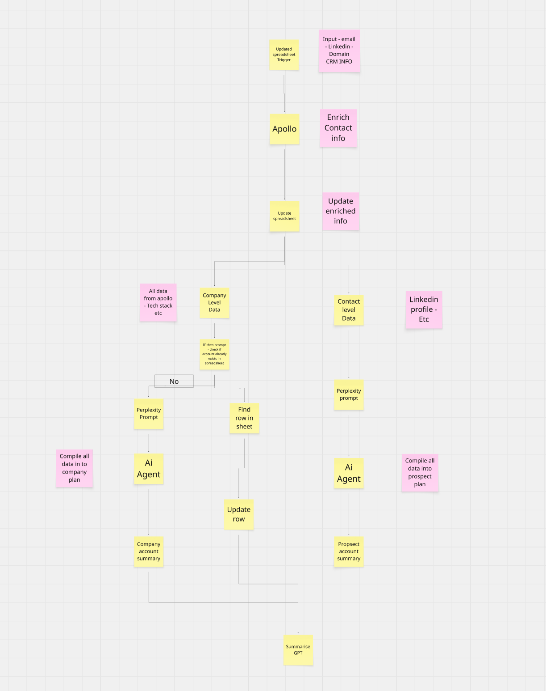
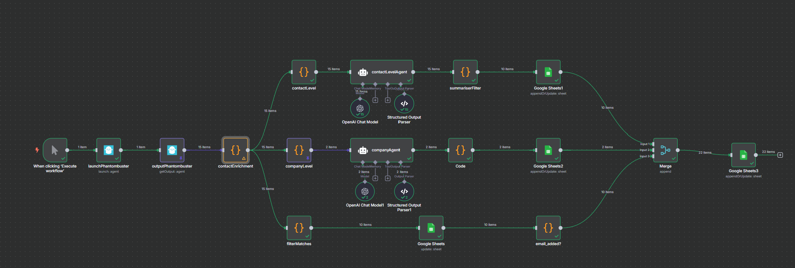

# n8n LinkedIn Contact Enrichment Workflow

This repository contains the resources and development scripts for an n8n workflow designed to automate the enrichment of contact data scraped from LinkedIn.

## Overview

The primary goal of this workflow is to take a list of LinkedIn profiles, scrape their data using PhantomBuster, and then use an AI model (OpenAI's GPT-4o) to intelligently extract contact information (emails and phone numbers) from unstructured text fields. The enriched data is then organized and stored in Google Sheets.

This solution is designed to solve the common problem of contact details on LinkedIn being obfuscated or embedded within descriptive text, making them difficult to extract with traditional scraping methods.

## Workflow Diagram

The complete n8n workflow is visualized in the flowchart below.
## Problem definition

## n8n workflow

## How It Works

The n8n workflow executes the following steps:

1.  **Trigger**: The workflow is initiated manually.
2.  **Launch PhantomBuster**: It starts a pre-configured PhantomBuster agent (a "Phantom") to scrape data from a list of specified LinkedIn profiles.
3.  **Get PhantomBuster Output**: It retrieves the results from the completed PhantomBuster run, which come in a JSON format containing the scraped profile data.
4.  **Data Preparation (`contactEnrichment` node)**: A "Set" node prepares the scraped data, structuring it for the subsequent enrichment steps. From here, the data flows into parallel branches for different types of enrichment.

### Parallel Enrichment Branches

The workflow splits into multiple branches to process data concurrently:

**A) Contact-Level AI Enrichment:**
-   **`contactLevelAgent` (OpenAI Chat Node)**: This is the core of the contact extraction logic. It sends the unstructured text fields for each contact (like bio, headline, summary) to an OpenAI model. A carefully crafted prompt instructs the model to find and parse any email addresses or phone numbers, even if they are obfuscated (e.g., "john (at) example (dot) com"). It returns the data in a structured format.
-   **`summariserFilter` Node**: This node likely filters or reformats the AI-generated output to ensure it's clean and consistent.
-   **`Google Sheets1` Node**: Appends the successfully extracted contact details to a designated Google Sheet.

**B) Company-Level AI Enrichment:**
-   **`companyAgent` (OpenAI Chat Node)**: This branch focuses on enriching company-related data. It might be used to find company websites, standardize industry names, or summarize company descriptions using another OpenAI call.
-   **`Code` Node**: A custom JavaScript code node for any necessary data transformation after company enrichment.
-   **`Google Sheets2` Node**: Appends the enriched company data to a separate Google Sheet or tab.

5.  **Merge**: The results from the parallel contact and company enrichment branches are combined into a single dataset.
6.  **Final Output**: The final, merged, and enriched data is appended to a master Google Sheet (`Google Sheets3`), creating a comprehensive and clean contact list.

## Setup & Prerequisites

To run this workflow, you will need:

-   An active **n8n** instance (cloud or self-hosted).
-   **PhantomBuster API Key**: To authenticate and run Phantoms.
-   **OpenAI API Key**: To make calls to the GPT models for data extraction.
-   **Google Sheets API Credentials**: To allow n8n to read from and write to your Google Sheets.

These credentials must be configured within your n8n instance.

## Development & Testing

The core AI prompt and data parsing logic were developed and tested outside of n8n to ensure reliability. The following scripts were used in the process:

-   `test_gpt4o_contact_extraction.py`: A Python script used to iterate on the OpenAI prompt. It reads scraped data from a local CSV file (`result.csv`), sends it to the GPT-4o API, and logs the results, which was crucial for debugging issues like URL normalization and refining the extraction prompt.
-   `enrich_contacts.js`: A standalone Node.js script created to mirror the logic of the n8n Code Node. This allowed for end-to-end testing of the contact enrichment process with local JSON data (`result.json`) before deploying it into the live workflow.